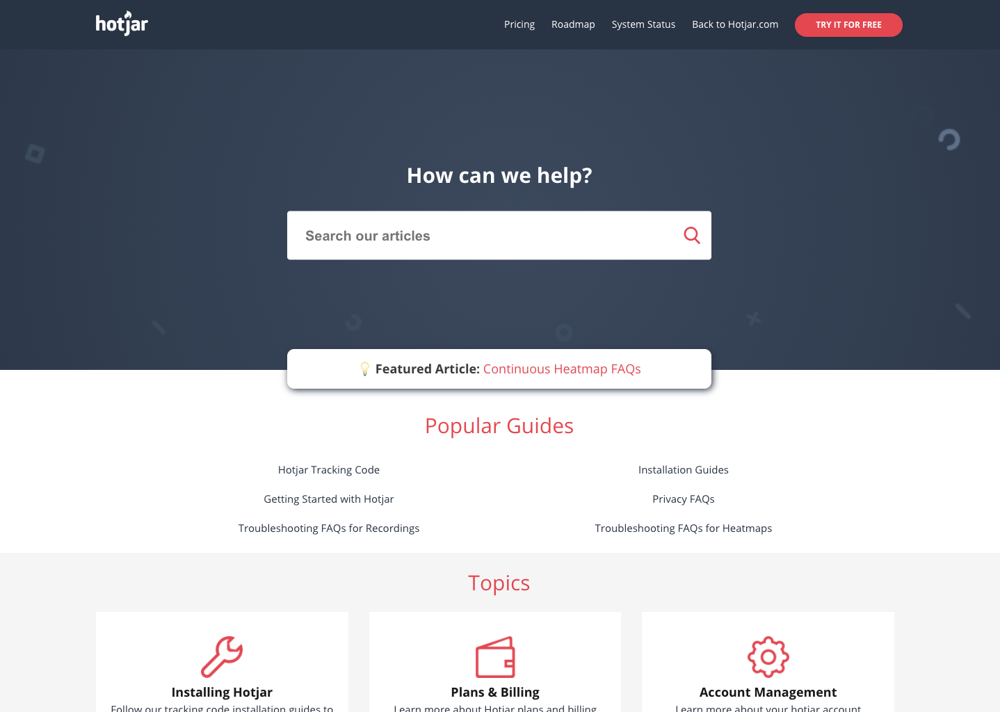
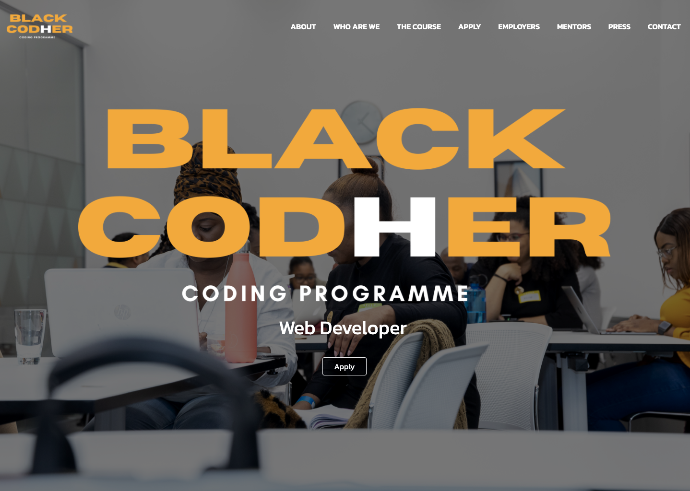
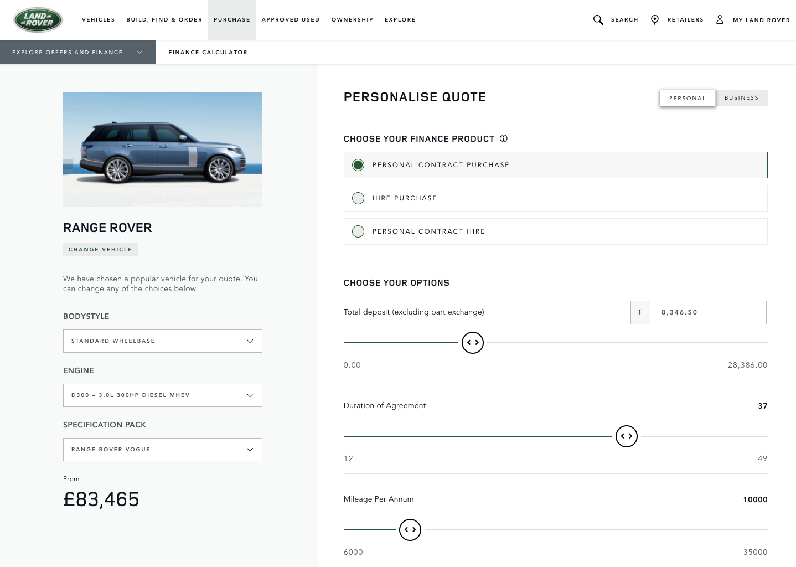

## Work.

### [Hotjar](https://hotjar.com).

  
  <ul>
    <li>Worked on React Apps and Python APIs for internal tools including a Zendesk App and a Chrome Extension.</li>
    <li>Created a Gitlab CI/CD Pipeline and implemented a Vue app and A/B testing framework in a Zendesk Theme for the <a href="https://help.hotjar.com">Help Center</a>.</li>
  </ul>

### [Black Codher](https://blackcodher.com/).

  
  <ul>
    <li>Instructed a group of young black women in a programme to learn to code and help get a job in tech. I taught the React module.</li>
    <li>Mentored one of the learners throughout her experience of the course.</li>
  </ul>

### [ITG Connect](https://teamitg.com/).

  
  <ul>
    <li>Improved and Maintained the Jaguar Land Rover <a href="https://www.landrover.co.uk/offers-and-finance/finance-calculator.html">finance calculator</a>, a React app with Redux.</li>
  </ul>

