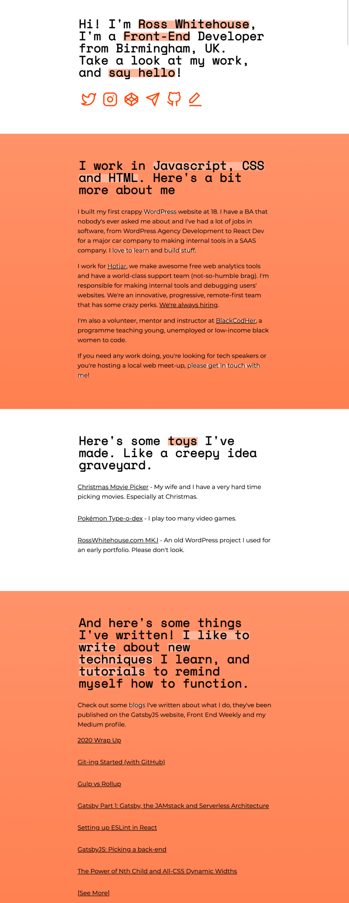
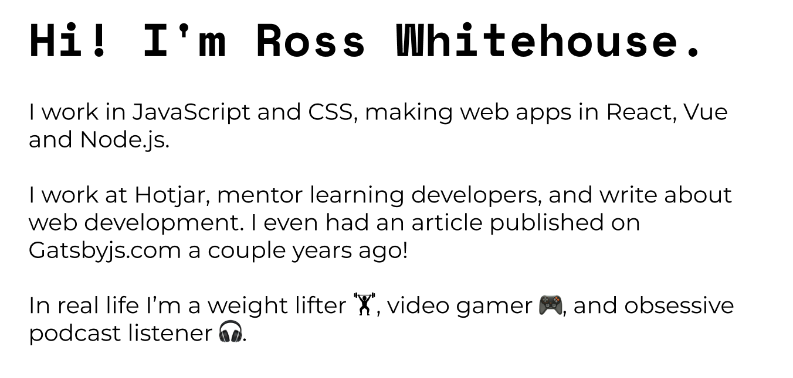
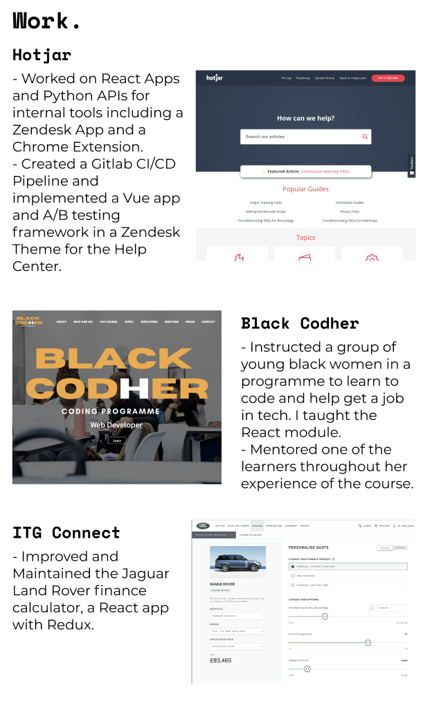
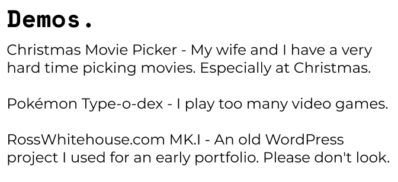
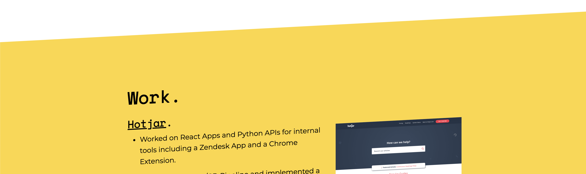
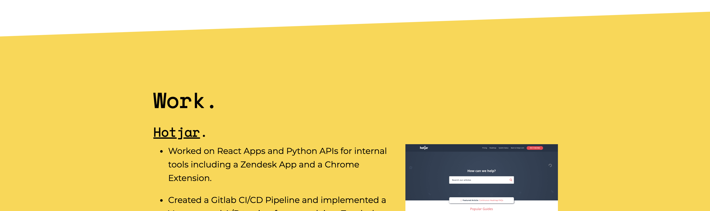
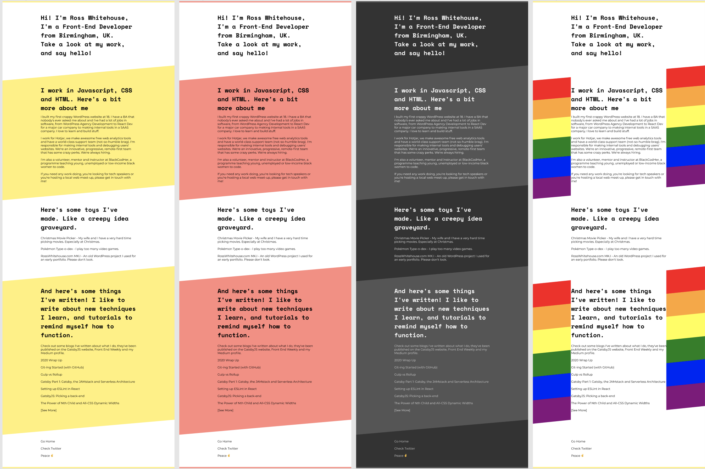
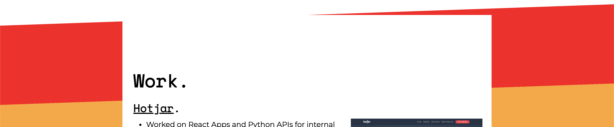

I just rewrote soe bits on the site and thought it was a great idea to share it!

## Inspiration 💡

If you don't listen to [Syntax](https://syntax.fm), you ought to! It's the best web development podcast around! They had a show earlier this year reviewing listener's websites. You can hear the show [on the Syntax website](https://syntax.fm/show/326/we-review-resumes-websites-and-online-presence) or in your podcast player. Anyway, they had some great tips, and I came out _very_ red faced 😳.

Here's a long png of the homepage, as-was:


Here's some things I identified I want to change:

- First, it's wordy! The last iteration of my site is basically a one-pager, but there was so much text! You don't need to know my life story, the important thing is for the user to understand who I am and what I do.
- Next, it lacks a bit of flare. There are these massive content blocks that I'm in love with, but that's sort of it, visually. I'd like a bit more... Oomph!
- There are no toys. One of my favourite sites that they reviewed, [jhey.dev](https://jhey.dev/), has loads of cool little toys. Simple things like a colour switcher to some really involved stuff that had me saying "How is that even happening?". I want that.

## Step 1: The Rewrite 📝

I won't dwell too much on this part, but in the new site, straight away I say what I do. "I work in JavaScript and CSS, making web apps in React, Vue and Node.js."



Next I write about what I do right now, in a broader sense: where I work, and other dev work like mentoring and writing.

Lastly, for a little injection of who I am, I include some of my hobbies with some emojis for a touch of fun.



Down in the work section I've really slimmed it down. It's direct, there's a couple of bullet points of information for the last 2 jobs I've done. And an image and link for each. If you want to see who I've worked for it's right there, whereas before, you'd have to dig that information out of the prose.



For the demos and writing section, I've taken most of the title out in a view to being direct, but the links and descriptions haven't changed.

These are super simple changes that really all just make it easier to parse and find the information you're after. If you want to see what I do, it's right there. If you want to see some cool toys I've made, it's obvious. Want to read my blogs? You don't need to read through the Iliad to get there (you bet your ass I just compared myself to Homer 🏛).

## Step 2: Flare it up 💃

In looking for visual flare I thought of two ideas immediately: First, let's see if we can make those blocks of colour a bit more dynamic by skewing them so the white space has a bit more colour. Secondly, I could never decide what colour I wanted. The site used to be yellow but in the screenshot you'll see it was a coral colour with a gradient. But then I thought: why not have both? In the Syntax episode I heard, Scott said he loves to see a dark mode, but that doesn't need to be the end of it! I could do both the colours I love, and a dark mode, and whatever else I want, with a little theme switcher in there. This also falls into the 'toy' category, so I'll talk about it down there.

The skewing of the blocks is easy enough to do with the use of the `transform` CSS property. My first instinct was to slap `transform: skew(0, 3deg);` on there. Which definitely skews the colour block. There is a slight issue with this though:



Everything is skewed!

I suppose I could have foreseen this, and I actually quite like the text skewed, but I think it would work better on smaller text, maybe some menu items or buttons - which generally I don't have.

There's an easy fix for it, though. I added a `div` inside each colour block with a `transform: skew(0, -3deg);` which should skew the text the other way, or back to normal.



## Step 3: Add some fun 🧸

Now we get to the hard part: making a theme swapper.

Firstly I laid out some colours I would like to do. Yellow and Coral were already on the cards, as well as a dark mode. Next I'd love to do something with a gradient, so I thought why not a rainbow of Pride colours all over there 🏳️‍🌈? Let's do it. Here's the designs:



They're all my favourite. Don't even ask.

So first I hooked up the yellow one, which was easy enough, and I came up with an idea for the switcher. I need to define some variables: the block colour, sometimes the background colour or the text colour too (for dark mode). Then, depending on a class, ID or a data property on the body, I need to change those variables to something else. Yellow to coral or whatever the user selects. I supposed I could do this in SCSS (that's what the styles are written in), but actually I couldn't find a way to redefine the variables as they're scoped to the file, but not to a specific element, so you can't redefine them if the body has a certain ID (or at least, not in a way that I could see easily).

What I did see around were CSS variables. CSS is basically taking all the good bits from SCSS to make it unnecessary, which I'm all for. CSS variables are defined slightly differently. The syntax is different (`$color` becomes `--var(color)`), but crucially for this project, they're defined on specific selectors. Which means I can define some defaults for primary and secondary colours on `:root` - a pseudo-class for the HTML element - then overwrite them in the properties of `body#theme-red`.

Here's the code that I ended up with:

```
:root {
  --yellow: #fdd835;
  --yellow-highlight: #fee781;
  --red: #ff8a80;
  --red-highlight: #ffd0cd;
}

body {
  &#theme-yellow {
    --main: var(--yellow);
    --highlight: var(--yellow-highlight);
  }

  &#theme-red {
    --main: var(--red);
    --highlight: var(--red-highlight);
  }
}
```

From there it was easy enough to hook up some buttons that change the body IDs, and they're stored in local storage so next time you come, your theme will persist.

For the Pride rainbow, I went straight to [cssgradient.io](https://cssgradient.io/) and started with the red colour with a stop at 16% (as there are 6 colours, we need a stop every 100/6). When I added that variable, I did see an issue that was introduced by the skew:



I had to add a white column behind the text, as no text colour stands out on top of a background of 6 different colours. But that means when the background is skewed, the colour bleeds over the edge. To fix this, I simply added a 5% white section either side of the gradient. The maths were a little tricky, but it really works well.


The final touch on this one was rotating the gradient for use at the top and bottom of the page, rather than having one red horizontal line. You can see that at the top of this page (depending on your theme).

Do you have a favourite theme, or any tips on anything I could do better? Let me know via the links below!
